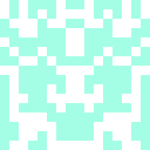
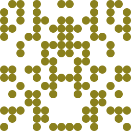
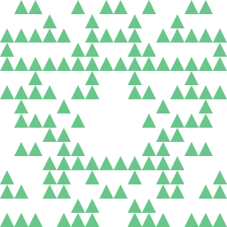
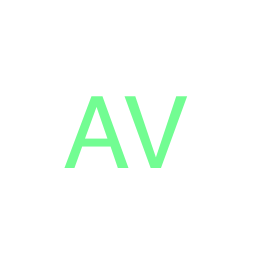

# avatar

Self-hosted service for creating random avatars

Inspired by github default avatars

## Examples

### Random

### Initials

## Usage

Default **Port**: `9000`

### Download

Either download a release from the [Releases page](https://github.com/frncsdrk/avatar/tags) or clone the repo.
Then follow the steps under [Development Setup](https://github.com/frncsdrk/avatar#setup).

### Docker

There is a container image available on [Docker Hub](https://hub.docker.com/r/frncsdrk/avatar)
and there is a Docker-Compose file in the repo.

## API

See [API Docs](https://frncsdrk.github.io/avatar)

## Development

### Setup

#### Prerequisites

- Node.js installation
- Libraries for image editing
- apiDoc installation, if editing docs

#### Steps

- Run `brew install node` or similar to install Node.js
- Run `brew install pkg-config cairo pango libpng jpeg giflib librsvg` or similar to install libraries for image editing
- Run `npm install -g apidoc` to install apiDoc globally

### Usage

- Run `npm start` to start service
- Run `npm run dev` to start service with nodemon
- Run `npm run generate:docs` to generate API docs from source code

## Contributions

See [CONTRIBUTING](https://github.com/frncsdrk/avatar/blob/main/CONTRIBUTING.md)

## Credits

See [CREDITS](https://github.com/frncsdrk/avatar/blob/main/CREDITS)

## License

[MIT](https://github.com/frncsdrk/avatar/blob/main/LICENSE) (c) 2018 - 2023 frncsdrk and contributors
